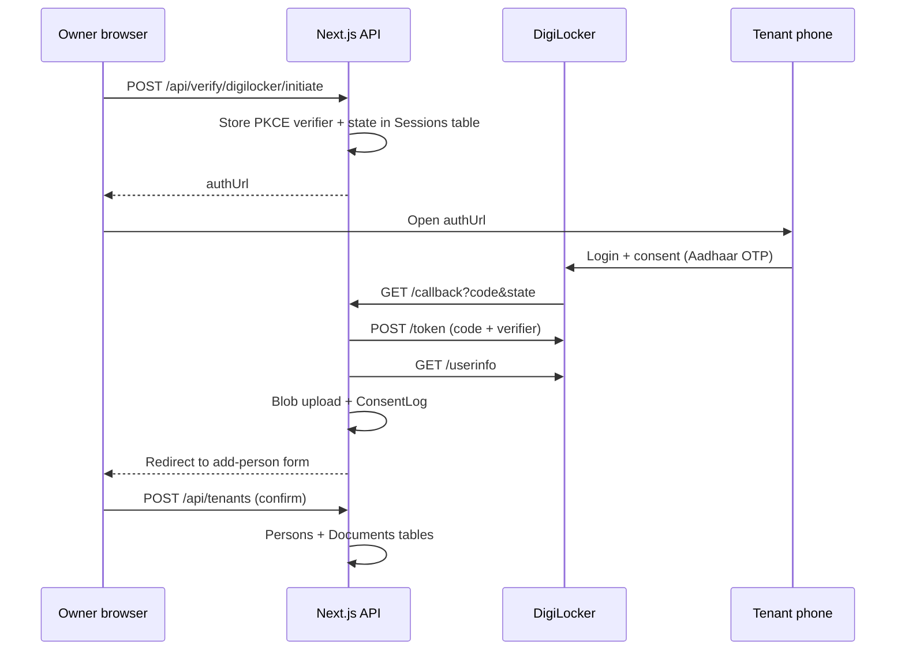

# DigiLocker integration guide

> Direct DigiLocker partner OAuth is currently disabled in the app. Active KYC
> verification runs through Sandbox APIs; see
> [sandbox-kyc-integration.md](./sandbox-kyc-integration.md).

This app uses **OAuth 2.0 + PKCE** via the MeriPehchaan gateway for tenant identity verification.

## 1. Partner registration

1. Apply at [DigiLocker Partner / Requester](https://www.digilocker.gov.in/web/partners/requesters).
2. Complete registration on [partners.digitallocker.gov.in](https://partners.digitallocker.gov.in).
3. Wait for approval (can take several days).
4. Obtain `client_id` and `client_secret`.

## 2. Redirect URI

Register **exact** callback URLs in the partner portal:

| Environment | URI |
|-------------|-----|
| Local | `http://localhost:3000/api/verify/digilocker/callback` |
| Production | `https://yourdomain.com/api/verify/digilocker/callback` |

The value must match `DIGILOCKER_REDIRECT_URI` in `.env.local` character-for-character.

## 3. Environment variables

```env
DIGILOCKER_CLIENT_ID=your_client_id
DIGILOCKER_CLIENT_SECRET=your_client_secret
DIGILOCKER_REDIRECT_URI=http://localhost:3000/api/verify/digilocker/callback
```

Without these, the app still runs; **Verify via DigiLocker** returns HTTP 503 with a configuration message.

## 4. Scopes

Requested scope (confirm against your approved partner list):

```
openid profile aadhaar_address
```

Adjust in `lib/digilocker/config.ts` if your approval includes different scopes.

## 5. OAuth flow (PKCE)



### Endpoints (MeriPehchaan)

| Step | URL |
|------|-----|
| Authorize | `https://digilocker.meripehchaan.gov.in/public/oauth2/1/authorize` |
| Token | `https://digilocker.meripehchaan.gov.in/public/oauth2/2/token` |
| Userinfo | `https://digilocker.meripehchaan.gov.in/public/oauth2/3/userinfo` |

Implementation: `lib/digilocker/oauth.ts`, `lib/digilocker/profile.ts`.

## 6. Data handling

- Only **masked Aadhaar** is stored in Azure Table (`Persons.maskedAadhaar`).
- Profile photo → private blob `persons/{tenantId}/photo.jpg`.
- eAadhaar XML (when available) → AES-256-GCM encrypted blob; key from `ENCRYPTION_KEY`.
- Consent events → append-only `ConsentLogs` table.

## 7. Testing

1. Configure env vars and restart `npm run dev`.
2. Create property → room → **Add tenant** → **Verify via DigiLocker**.
3. Complete flow on tenant device; return and click **I completed verification — refresh**.
4. Review auto-filled form → **Confirm & save tenant**.

If partner sandbox credentials are provided, use those in `.env.local` instead of production keys.

## 8. Troubleshooting

| Error | Likely cause |
|-------|----------------|
| `invalid_redirect_uri` | Redirect URI mismatch with partner portal |
| `invalid_grant` | Expired code, reused code, or wrong PKCE verifier |
| `invalid_client` | Wrong `client_id` / `client_secret` |
| Session expired | OAuth took longer than 10 minutes — restart flow |
| 503 on initiate | Missing DigiLocker env vars |
| Consent denied | Tenant cancelled on DigiLocker screen |

## 9. Compliance reminders

- Show purpose limitation text before verification (`ConsentBanner` component).
- Never persist full 12-digit Aadhaar (API validation rejects it).
- Use SAS URLs (1 hour) for document viewing — no public blob access.
